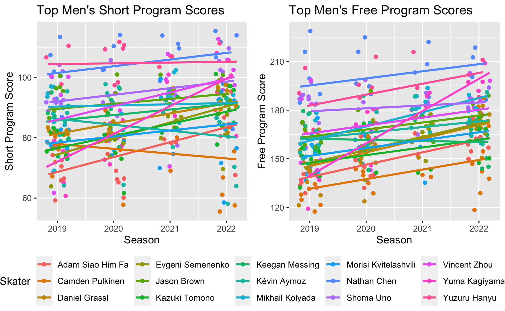
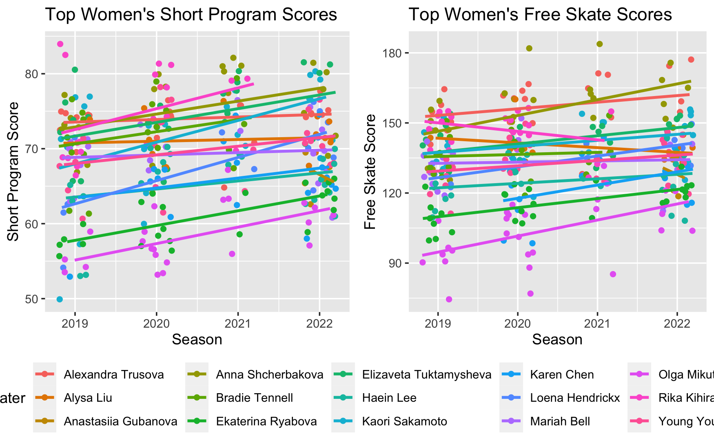
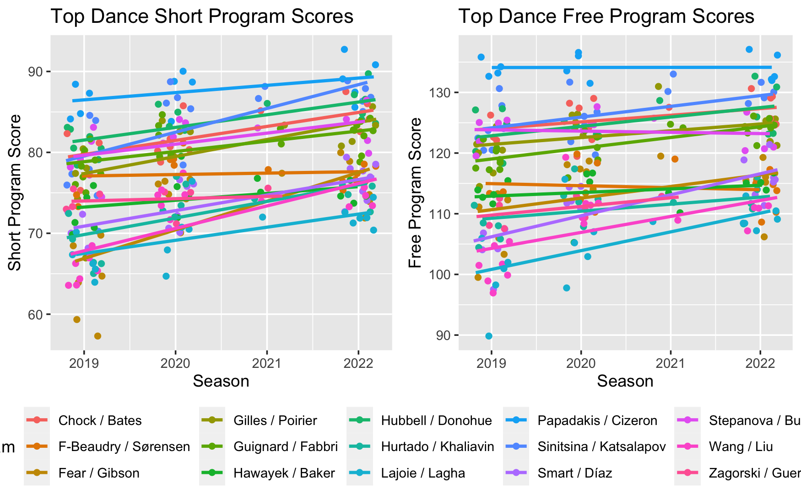
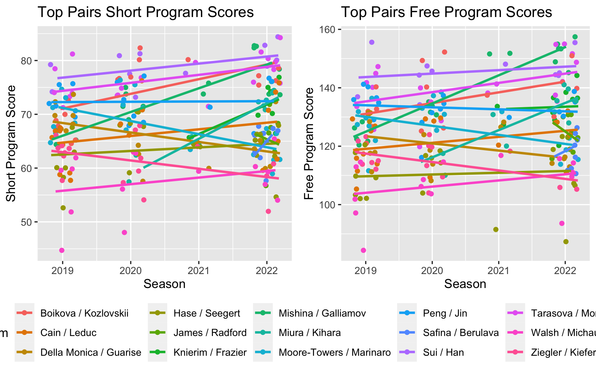
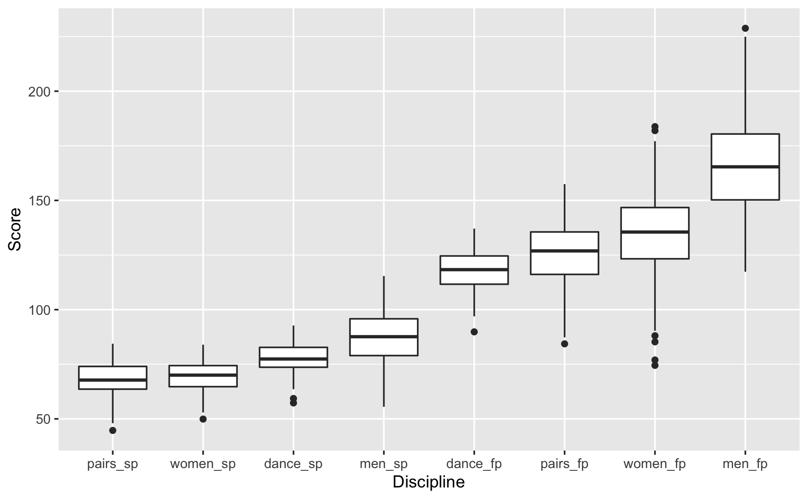

```{r xaringan-themer, include=FALSE, warning=FALSE}
library(xaringanthemer)
# style_mono_accent(
#   base_color = "#1c5253",
#   header_font_google = google_font("Josefin Sans"),
#   text_font_google   = google_font("Montserrat", "300", "300i"),
#   code_font_google   = google_font("Fira Mono")
# )
style_mono_light(base_color = "#23395b")
```


# Intro to the Research Topic 

My final project seeks to analyze figure skating competition data from the past Olympic cycle in order to predict the 2022 World Championship results and assess potential judging bias. 

### Research Question
- What are the most significant predictors that determine a skater's total score and rank, and how can we use this to predict the 2022 World Championships? 
- Do skaters receive a home-town advantage in scores when competing in their home country? 

---
# Data Collection Process

I scraped data using the `rvest` package from skatingscores.com, which uploads scoring protocols from all international and major domestic competitions under the IJS (International Judging System).
- I chose skaters who earned the top 15 free skate scores at the past two senior world championships (2022 and 2021). 
- Selected skaters who competed at the world championships because oftentimes large countries like Russia will have several top scoring skaters, but each country can only send a maximum of three skaters to the world championships. 
- Due to the volatile nature of the sport and short-lived seasons of skaters, I chose skaters who have been performing well in the past two years. 

Due to the Russia-Ukraine conflict in recent months, the International Skating Union banned Russian athletes from participating in any international figure skating competitions on or after March 1, 2022, including the 2022 World Championships.


---
## Initial EDA
```{r, echo=FALSE, fig.show='hold',fig.align='center'}
# knitr::include_graphics(c("images/men_eda.png", "images/women_eda.png", "images/dance_eda.png", "images/pairs_eda.png"))

```

---
```{r, echo=F}

```

**Observations**: 
- Chen and Hanyu dominate in the men's discipline
- Women's discipline has less consistent champions
- We see many intersecting lines and much movement across seasons

---
```{r, echo=F}

```

**Observations**: 
- Much more consistent rankings across seasons and teams 
- Smaller range of scores
- Differences between scores diminish in recent years 

---
```{r, echo=F}

```

**Observations**: 
- Fewer data points during the 2021 season due to COVID
- Generally consistent rankings across seasons 

---


```{r, echo=F}

```

**Observations**: 
- Dance scores have lower variance than other discplines
- Men's scores are higher and consist of more outliers 

---
# Modeling Plan
### Prediction
- OLS: outcome is the final score, predictors: technical segment score, program component score
- Mixed effects model: incorporate home-town advantage, starting order

### Judging Bias
- Use Spearman's Rank Correlation to assess how judges' rankings line up with the final skater rankings
- Hypothesis testing for a difference in scores given to skaters of their own country vs foreign skaters

---
# Results

---
# Discussion

---

# Next Steps and Questions
.pull-left[
]
.pull-right[
- Hypothesis: There is more variance between scores in singles skating than in ice dance and pairs. Run t-tests for significance on TSS and mean GOE.
- Plan to scrape the actual dates for the events so the data can follow a more continuous time scale
]
