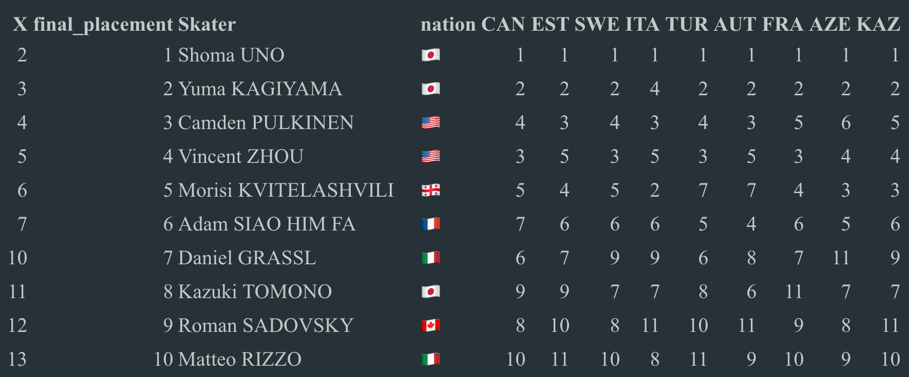
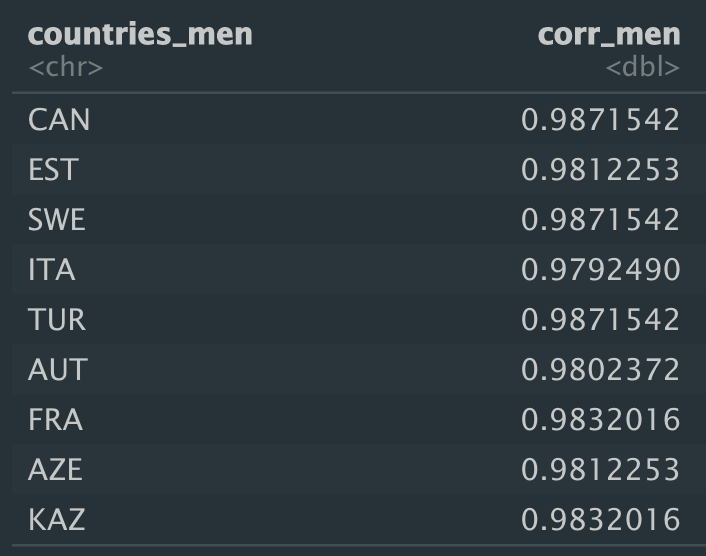
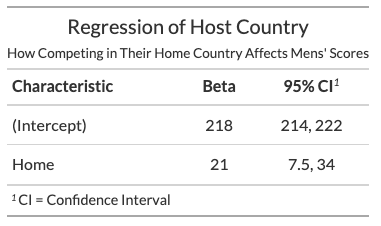
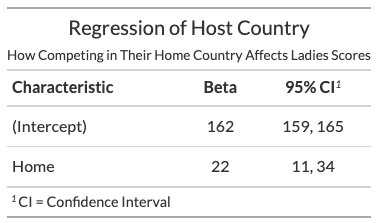
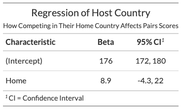

```{r xaringan-themer, include=FALSE, warning=FALSE}
library(xaringanthemer)
# style_mono_accent(
#   base_color = "#1c5253",
#   header_font_google = google_font("Josefin Sans"),
#   text_font_google   = google_font("Montserrat", "300", "300i"),
#   code_font_google   = google_font("Fira Mono")
# )
style_mono_light(base_color = "#23395b")
```


# Intro to the Research Topic 

My final project seeks to analyze figure skating competition data from the past Olympic cycle in order to predict the 2022 World Championship results and assess potential judging bias. 

### Research Question
- What are the most significant predictors that determine a skater's total score and rank, and how can we use this to predict the 2022 World Championships? 
- Do skaters receive a home-town advantage in scores when competing in their home country? 

---
# Data Collection Process

I scraped data using the `rvest` package from skatingscores.com, which uploads scoring protocols from all international and major domestic competitions under the IJS (International Judging System).
- I chose skaters who earned the top 15 free skate scores at the past two senior world championships (2022 and 2021). 
- Selected skaters who competed at the world championships because oftentimes large countries like Russia will have several top scoring skaters, but each country can only send a maximum of three skaters to the world championships. 
- Due to the volatile nature of the sport and short-lived seasons of skaters, I chose skaters who have been performing well in the past two years. 

Due to the Russia-Ukraine conflict in recent months, the International Skating Union banned Russian athletes from participating in any international figure skating competitions on or after March 1, 2022, including the 2022 World Championships.


---
## Initial EDA
```{r, echo=FALSE, fig.show='hold',fig.align='center'}
# knitr::include_graphics(c("images/men_eda.png", "images/women_eda.png", "images/dance_eda.png", "images/pairs_eda.png"))

```

---
```{r, echo=F}

```

**Observations**: 
- Chen and Hanyu dominate in the men's discipline
- Women's discipline has less consistent champions
- We see many intersecting lines and much movement across seasons

---
```{r, echo=F}

```

**Observations**: 
- Much more consistent rankings across seasons and teams 
- Smaller range of scores
- Differences between scores diminish in recent years 

---
```{r, echo=F}

```

**Observations**: 
- Fewer data points during the 2021 season due to COVID
- Generally consistent rankings across seasons 

---


```{r, echo=F}

```

**Observations**: 
- Dance scores have lower variance than other discplines
- Men's scores are higher and consist of more outliers 

---
# Modeling Plan
### Prediction
- OLS: outcome is the final score, predictors: mean GOE mark, mean PCS mark
Each segment is normally distributed based on the predictors, previous personal best ($h_{short}$), mean GOE ($\text{goe}_i$), and mean PCS ($\text{pcs}_i$). *Note PB is not included yet

$$\text{short}_i \sim N(\beta_{0, short} + \beta_{1, short} * h_{short} + \beta_2 * \text{goe}_i + \beta_3*\text{pcs}_i, \sigma^2_{short})$$

$$\text{long}_i \sim N(\beta_{0, long} + \beta_{1, long} * h_{long} + \beta_2 * \text{goe}_i + \beta_3*\text{pcs}_i, \sigma^2_{long})$$
- Mixed effects model: incorporate home-town advantage, starting order
---
### Judging Bias
- Use Spearman's Rank Correlation to assess how judges' rankings line up with the final skater rankings
- Bayesian generalized linear model (stan_glm) to check for a correlation between competing in home country and final score: $y = f(\beta_0+\beta_1*\text{home})$

---
# Results

```{r, echo=F, include=F}
library(tidyverse)
all_men <- read.csv('data/all_men.csv')
fp_men <- all_men %>% filter(Seg == "FS")
sp_men <- all_men %>% filter(Seg == "SP")
```

```{r, messages=F, warnings=FALSE,}
summary(lm(TES ~ MeanGOE.Mark + MeanPCS.Mark, data = fp_men))
```

---
```{r}
summary(lm(TES ~ MeanGOE.Mark + MeanPCS.Mark, data = sp_men))
```

---
# Spearman rank correlations

.pull-left[

The high correlations indicate that judges generally agree with each other, but we note that the Italian judge has the lowest correlation. 

In the final paper I will test for whether this statistic is significantly lower than the correlations of the other judges.

]
.pull-right[

]
---
# Home Country Advantage
.pull-left[


Confidence interval does not contain 0
]


.pull-right[


Confidence interval contains 0
]

---
# Discussion & Conclusion
.pull-left[
**Prediction**
- Grade of Execution and Program Component Scores are strong indicators of final score, although GOE holds a stronger weight (beta coefficient = 4.63 for GOE vs. 2.38 for PCS)
- These beta coefficients are highly significant
]
.pull-right[
**Bias**
- There is a strong indication of advantage for skaters competing in their hometown, but this may be conflated with the fact that countries with top skaters are more likely to host competitions
- Judges have generally high agreeability, but we should look further into whether low correlations are significant results
]

<!-- --- -->

<!-- # Next Steps and Questions -->
